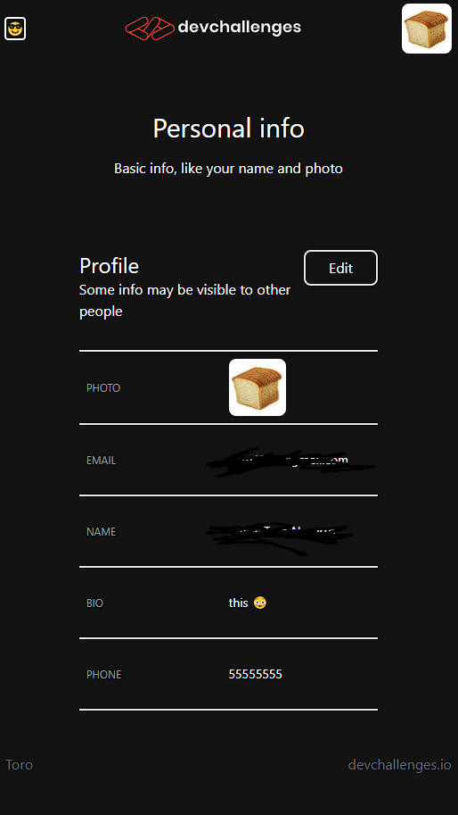

<!-- Please update value in the {}  -->

<h1 align="center">{Auth with next and stuff}</h1>

   Solution for a challenge from  <a href="http://devchallenges.io" target="_blank">Devchallenges.io</a>.

  <h3>
    <a href="https://authwithnextchallenge.vercel.app">
      Demo
    </a>
     | 
    <a href="https://github.com/XxtbmfxX/authwithnextchallenge">
      Solution
    </a>
     | 
    <a href="https://devchallenges.io/challenges/N1fvBjQfhlkctmwj1tnw">
      Challenge
    </a>
  </h3>

<!-- TABLE OF CONTENTS -->

## Table of Contents

- [Overview](#overview)
  - [Built With](#built-with)
- [Features](#features)

<!-- OVERVIEW -->

## Overview

---

- This took about 20 hours to complete (I'm still not satisfied with the final result)
- I'll try some app development and try to find a work before the next month.
- I did this twice

# Built With

<!-- This section should list any major frameworks that you built your project using. Here are a few examples.-->

- [Tailwind](https://tailwindcss.com/)
- [Next 13](https://nextjs.org)
- [Authjs](https://authjs.dev)
- [Git](https://git-scm.com)
- [GitHub](https://github.com)
- [Prisma](https://www.prisma.io) (ORM)
- [Railway](https://railway.app) (DB)
- Mobile first workflow
- CI/CD and blablabla those things in the job requirements

---

## Features

<!-- List the features of your application or follow the template. Don't share the figma file here :) -->

This application/site was created as a submission to a [DevChallenges](https://devchallenges.io/challenges) challenge. The [challenge](https://devchallenges.io/challenges/N1fvBjQfhlkctmwj1tnw) was to build an application to complete the given user storie.
